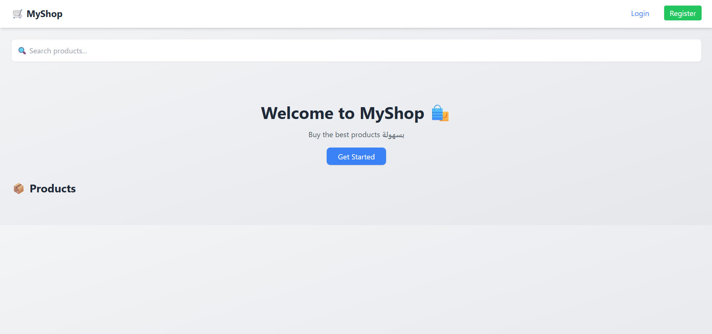

# 🛒 MyShop - E-commerce Project (Laravel + JS)

## 📌 Description

MyShop is a simple e-commerce web application built using **Laravel (backend)** and **Vanilla JavaScript + TailwindCSS (frontend)**.

The project allows users to browse products, add them to cart, place orders, and interact with a modern shopping system. It also includes an **admin dashboard** to manage products and orders.

---

## 🚀 Features

### 👤 User

* Register & Login (secure validation)
* Browse products 🔍
* Add to cart 🛒
* Add to wishlist ❤️
* Place orders (checkout)
* View products with ratings ⭐

### 👑 Admin

* Admin authentication
* Dashboard access
* Manage products (CRUD)
* Manage categories
* View all orders 📦
* Update order status (pending → shipped)

---

## 🔐 Authentication

* Laravel Sanctum
* Token-based authentication
* Role system (admin / user)

---

## 🧠 Tech Stack

* Backend: Laravel
* Frontend: HTML, TailwindCSS, JavaScript
* Database: MySQL
* Auth: Laravel Sanctum

---

## ⚙️ Installation

```bash
git clone https://github.com/your-username/myshop.git
cd myshop

composer install
cp .env.example .env
php artisan key:generate

# configure database in .env

php artisan migrate
php artisan db:seed
php artisan serve
```

---

## 👑 Admin Access

```
Email: admin@test.com
Password: Admin123@
```

---

## 📦 API Routes (examples)

* POST `/api/register`
* POST `/api/login`
* GET `/api/products`
* POST `/api/cart`
* POST `/api/checkout`
* GET `/api/admin/orders`

---

## 📸 Screenshots (optional)




---

## 🌍 Live Demo (optional)

(Add Render or hosting link here)

---

## 🎯 Future Improvements

* Order details (products per order)
* Payment integration 💳
* Notifications 🔔
* Advanced dashboard (statistics)

---

## 👨‍💻 Author

* Your Name
* GitHub: https://github.com/jaidiayoub55-spec
